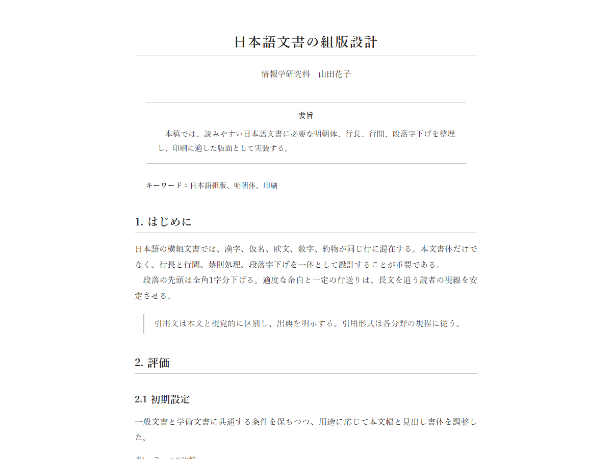
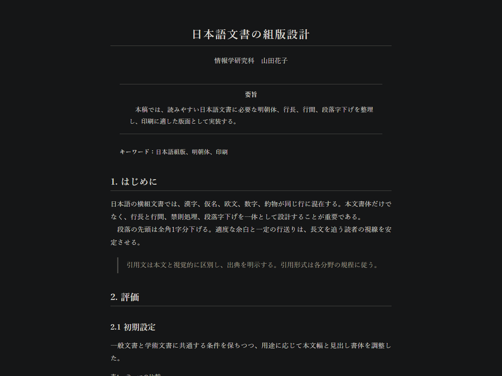
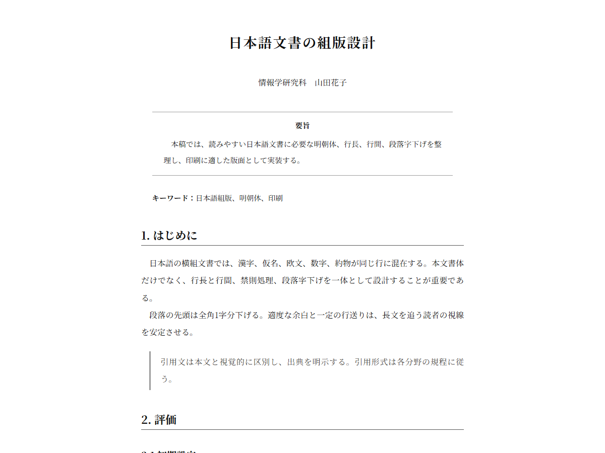
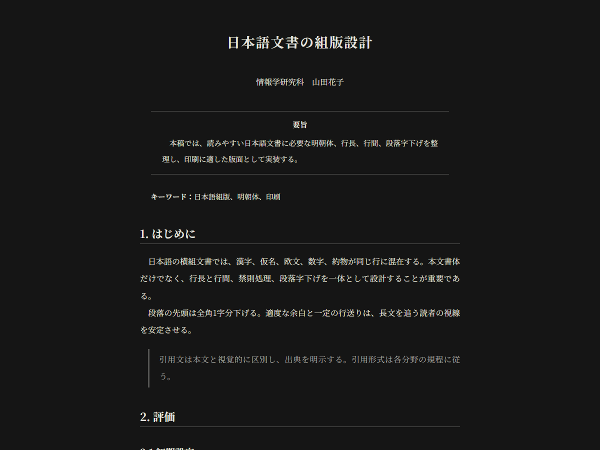
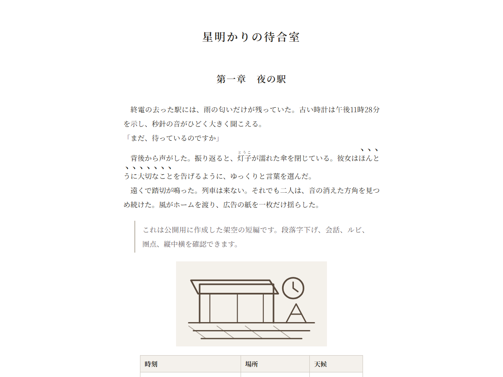
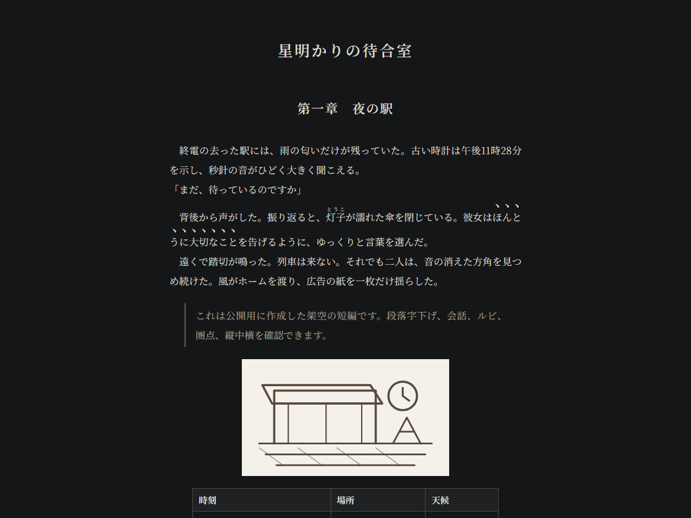
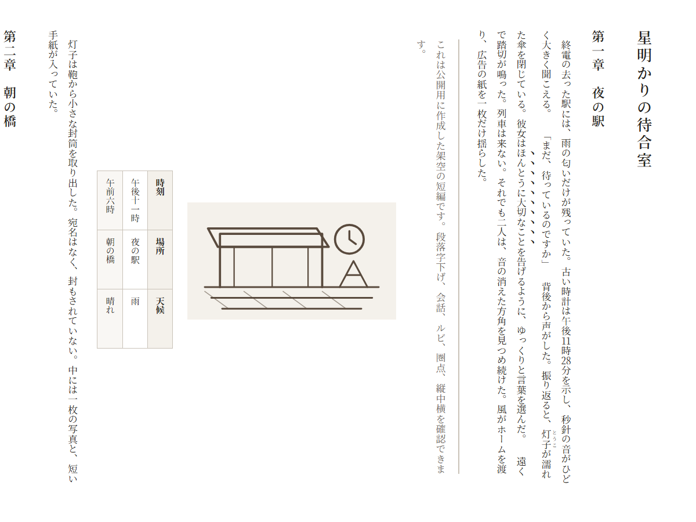
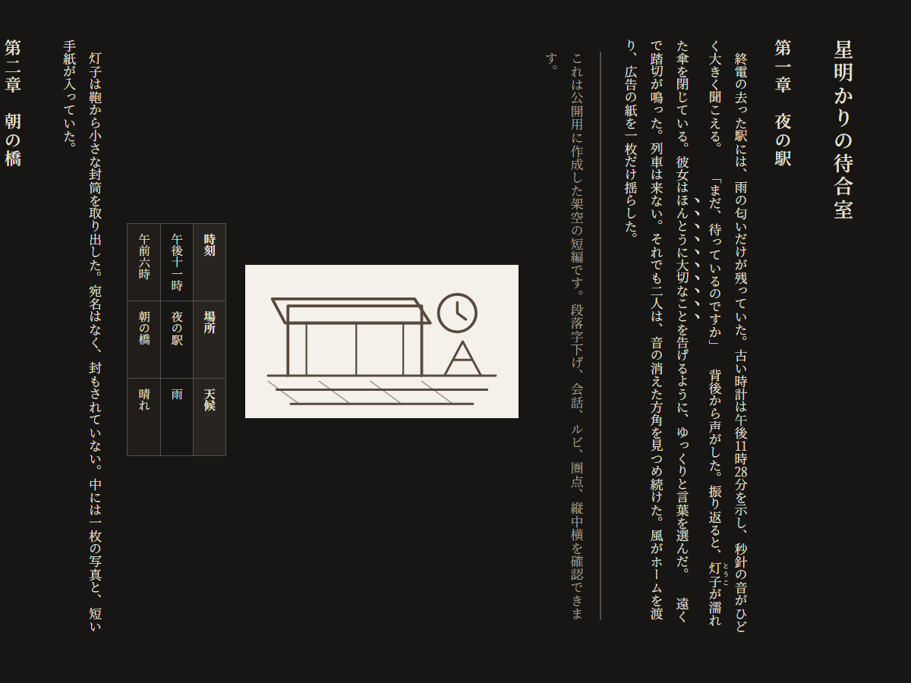

# Typora Japanese Print Themes

日本語の長文執筆とA4印刷に合わせた、Typora用の明朝体テーマ集です。

一般文書、論文・レポート、横書き・縦書き小説向けの8テーマを収録しています。

ライトテーマは白一色（`#ffffff`）で、外枠を設けないシンプルな表示です。ダークテーマは画面のみ濃色になり、印刷・PDF出力時は白背景・黒文字になります。A4と余白の指定は、印刷・PDF出力時だけ適用されます。

字面の不揃いや端末ごとのフォント差を避けるため、学術・小説テーマには **`Noto Serif JP`** を同梱し、本文や見出しを同じ書体へ統一しています。

> [!IMPORTANT]
> 本テーマは、Codex/ChatGPTにより検索・実装した、一般的な日本語組版と複数の大学の要領から導いた設計になります。大学・学会・出版社の指定がある場合は、その執筆要領を優先してください。

## 1. プレビュー

| Japanese Print | Japanese Print Dark |
| --- | --- |
|  |  |

| Japanese Academic | Japanese Academic Dark |
| --- | --- |
|  |  |

| Japanese Novel | Japanese Novel Dark |
| --- | --- |
|  |  |

| Japanese Novel Vertical | Japanese Novel Vertical Dark |
| --- | --- |
|  |  |

> 一般・学術テーマは公開用の架空文書、小説テーマは [公開用の架空サンプル](examples/novel-sample.md) を使用しています。

### テーマの違い

| テーマ | 主用途 | 編集画面 | 段落 | 印刷 |
| --- | --- | --- | --- | --- |
| Japanese Print | 報告書、解説、長文ノート | 白 | 1字下げ、見出し直後は天付き | A4、10pt、四辺25mm |
| Japanese Print Dark | 報告書、解説、長文ノート | ダーク | 1字下げ、見出し直後は天付き | Japanese Printと同じ白紙 |
| Japanese Academic | 論文、卒論・修論、研究レポート | 白 | 原則すべて1字下げ | A4、10pt、四辺25mm |
| Japanese Academic Dark | 論文、卒論・修論、研究レポート | ダーク | 原則すべて1字下げ | Japanese Academicと同じ白紙 |
| Japanese Novel | 横書き小説 | 白 | 1字下げ | A4、10pt、上下24mm・左右25mm |
| Japanese Novel Dark | 横書き小説 | ダーク | 1字下げ | Japanese Novelと同じ白紙 |
| Japanese Novel Vertical | 縦書き小説 | 白・縦組 | 1字下げ | A4縦、10pt、四辺20mm |
| Japanese Novel Vertical Dark | 縦書き小説 | ダーク・縦組 | 1字下げ | Verticalと同じ白紙 |

## 2. インストール

1. [Releases](../../releases/latest) からZIPを取得して展開します。
2. Typoraで `ファイル` → `設定` → `外観` → `テーマフォルダを開く` を選びます。
3. ZIPに入っているすべてのCSSとフォルダを、そのままテーマフォルダへコピーします。
4. Typoraを再起動し、`テーマ` メニューから使用するテーマを選びます。

リポジトリを直接取得した場合は、`themes` フォルダの中身をそのままコピーしてください。

## 3. 使い方と設定

### 3.1 PDF・印刷

Typoraの `設定` → `エクスポート` → `PDF` で、用紙サイズを **A4** に設定してください。

テーマの `@page` には、次の余白を初期値として指定しています。

| テーマ | 余白 |
| --- | --- |
| 一般・学術 | 四辺25mm |
| 横書き小説 | 上下24mm、左右25mm |
| 縦書き小説 | 四辺20mm |

Typora側のエクスポート設定が優先される環境では、同じ値をPDF設定にも入力してください。

### 3.2 小説テーマ

小説テーマは、通常段落を1字下げで表示します。会話、ルビ、縦中横、場面転換には、必要な箇所だけHTML記法を使用できます。

| 記法 | 用途 |
| --- | --- |
| `<span class="dialogue">...</span>` | 会話行を天付きにする |
| `<ruby>...<rt>...</rt></ruby>` | ルビを付ける |
| `<span class="tcy">...</span>` | 縦書きで短い数字を縦中横にする |
| `<span class="scene-break">...</span>` | 場面転換の区切りを表示する |
| `*強調*` | 斜体ではなく圏点として表示する |

```html
<span class="dialogue">「会話を天付きにする例です」</span>
<ruby>灯子<rt>とうこ</rt></ruby>
午後<span class="tcy">11</span>時<span class="tcy">28</span>分
<span class="scene-break">＊　＊　＊</span>
```

`dialogue` と `scene-break` は、それぞれ独立した行に置いてください。`tcy` は、2桁程度の短い数字へ本文中で個別に指定します。

縦書きテーマでは、ブロックHTMLの `<p class="...">` よりもインラインHTMLの `<span class="...">` を推奨します。TyporaのHTML編集欄が横方向に大きな幅を取るためです。Markdown画像は本文と重ならない独立ブロックになり、表のセルも縦組みで表示されます。

使用例は [examples/novel-sample.md](examples/novel-sample.md) を参照してください。

> [!CAUTION]
> Typoraの縦書き対応には制約があります。そのため、縦書きテーマは閲覧とPDF出力を主な用途とし、長文の編集には横書きテーマを使うようにしてください。詳細は [縦書きテーマの注意事項](docs/vertical-writing-notes.md) を確認してください。

### 3.3 学術テーマの補助クラス

学術テーマでは、Markdown内にHTMLを記述して、表題情報、要旨、キーワード、図表キャプションを整えられます。

| クラス | 用途 |
| --- | --- |
| `document-meta` | 所属や氏名などの表題情報 |
| `abstract` | 要旨のセクション |
| `keywords` | キーワード |
| `figure-caption` | 図のキャプション |
| `table-caption` | 表のキャプション |

```html
<p class="document-meta">所属　氏名</p>

<section class="abstract">
<h2>要旨</h2>
<p>ここに要旨を記述します。</p>
</section>

<p class="keywords"><strong>キーワード：</strong>日本語組版、Typora</p>
<p class="figure-caption">図1　図の説明</p>
<p class="table-caption">表1　表の説明</p>
```

使用例は [examples/sample.md](examples/sample.md) を参照してください。

### 3.4 ユーザーCSSによる調整

テーマ本体を直接変更せず、Typoraのテーマフォルダに `{テーマ名}.user.css` を作成すると、テーマ更新後も設定を維持できます。

変更するテーマCSSと同じ名前を使用してください。たとえば、次のように作成します。

- `japanese-print-dark.user.css`
- `japanese-academic-dark.user.css`
- `japanese-novel-vertical.user.css`


```css
:root {
  --jp-print-font-size: 12pt;
  --jp-print-title-font-size: 15pt;
  --jp-print-measure: 35em;
  --jp-print-line-height: 2;
}
```

主な変数は次のとおりです。

| 変数 | 内容 |
| --- | --- |
| `--jp-font-body` | 本文フォントの優先順 |
| `--jp-font-heading` | 見出しフォントの優先順 |
| `--jp-print-font-size` | 印刷時の本文サイズ |
| `--jp-print-title-font-size` | 印刷時の表題サイズ |
| `--jp-screen-measure` | 横書き小説テーマの編集画面における本文幅 |
| `--jp-print-measure` | 印刷時の本文幅 |
| `--jp-line-height` | 編集画面の本文行高 |
| `--jp-print-line-height` | 印刷時の本文行高 |
| `--jp-paragraph-indent` | 段落先頭の字下げ |

最初のH1は文書表題として扱い、印刷時は初期値で13.5ptになります。表題サイズは `--jp-print-title-font-size` で変更できます。

`--jp-print-measure: 40em` は約40字幅の目安ですが、フォント、約物、欧文混植によって実際の字数は変わります。厳密な字数・行数指定がある場合は、PDFを出力して提出先の要領と照合してください。

## 4. 詳細資料

- [設計根拠](docs/design-rationale.md)：調査資料、初期値、CSSで再現できる範囲
- [縦書きテーマの注意事項](docs/vertical-writing-notes.md)：縦書き編集、表示、印刷時の制約

## 5. 開発

Node.js 18以降で、外部パッケージを追加せずに検証できます。

```sh
npm test
```


## 6. ライセンス

- テーマのCSS、文書、スクリプト：[MIT License](LICENSE)
- 同梱するNoto Serif JP：[SIL Open Font License 1.1](themes/japanese-print/fonts/OFL.txt)
